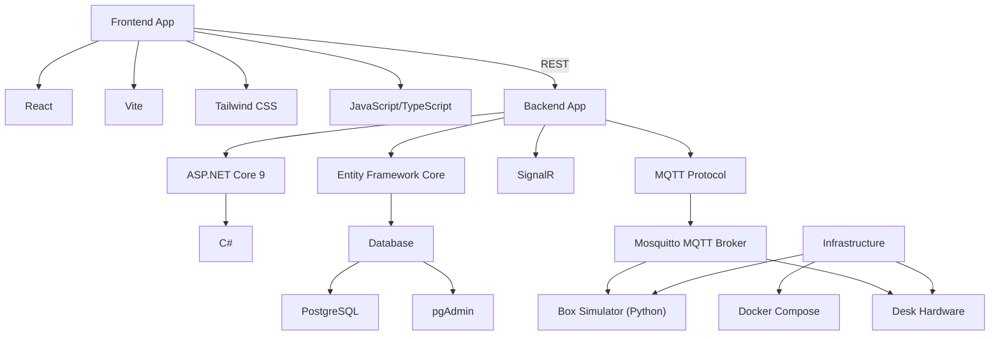
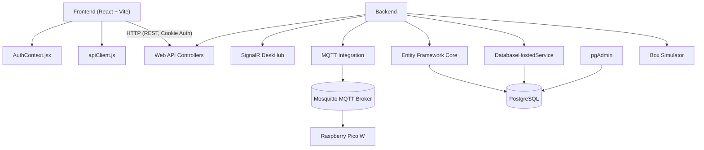
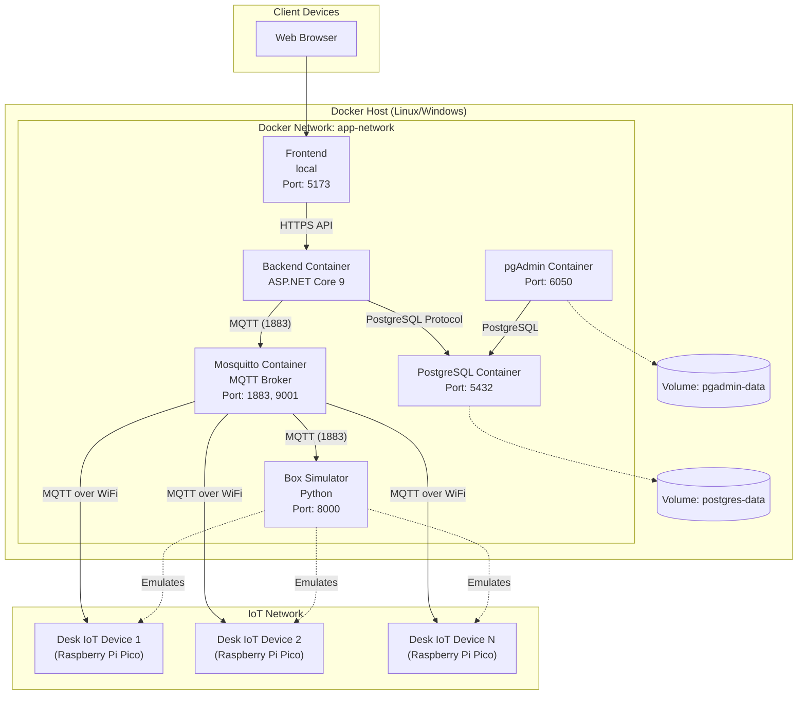

## Technology Layer Diagram

```mermaid
flowchart TD
    React["React"]
    Vite["Vite"]
    Tailwind["Tailwind CSS"]
    JS["JavaScript/TypeScript"]
    FE["Frontend App"]
    FE --> React
    FE --> Vite
    FE --> Tailwind
    FE --> JS

    DotNet["ASP.NET Core 9"]
    CSharp["C#"]
    EF["Entity Framework Core"]
    SignalR["SignalR"]
    MQTT["MQTT Protocol"]
    BE["Backend App"]
    BE --> DotNet
    DotNet --> CSharp
    BE --> EF
    BE --> SignalR
    BE --> MQTT

    PG["PostgreSQL"]
    PgAdmin["pgAdmin"]
    DB["Database"]
    DB --> PG
    DB --> PgAdmin

    Docker["Docker Compose"]
    Mosquitto["Mosquitto MQTT Broker"]
    BoxSim["Box Simulator (Python)"]
    HW["Desk Hardware"]
    Infra["Infrastructure"]
    Infra --> Docker
    MQTT --> Mosquitto
    Infra --> BoxSim
    Infra --> HW

    FE -- "REST" --> BE
    EF  --> DB
    Mosquitto --> BoxSim
    Mosquitto --> HW
```

## Application layer

```mermaid
flowchart TD
    FE["Frontend (React + Vite)"]
    AuthContext["AuthContext.jsx"]
    APIClient["apiClient.js"]
    FE --> AuthContext
    FE --> APIClient

    BE["Backend"]
    API["Web API Controllers"]
    SignalR["SignalR DeskHub"]
    MQTT["MQTT Integration"]
    EF["Entity Framework Core"]
    Seed["DatabaseHostedService"]
    BE --> API

    BE --> SignalR
    BE --> MQTT
    BE --> EF
    BE --> Seed

    DB[("PostgreSQL")]
    PgAdmin["pgAdmin"]
    EF --> DB
    Seed --> DB
    PgAdmin --> DB

    Mosquitto[("Mosquitto MQTT Broker")]
    BoxSim["Box Simulator"]
    DeskHW["Raspberry Pico W"]
    MQTT --> Mosquitto
    BE --> BoxSim
    Mosquitto --> DeskHW

    FE -- "HTTP (REST, Cookie Auth)" --> API
```

## Infrastructure Layer Diagram

```mermaid
graph TB
    subgraph "Client Devices"
        Browser["Web Browser<br/>"]
    end

    subgraph "Docker Host (Linux/Windows)"
        subgraph "Docker Network: app-network"
            Frontend["Frontend <br/>local<br/>Port: 5173"]
            BackendContainer["Backend Container<br/>ASP.NET Core 9<br/>"]
            PostgresContainer["PostgreSQL Container<br/>Port: 5432"]
            PgAdminContainer["pgAdmin Container<br/>Port: 6050"]
            MosquittoContainer["Mosquitto Container<br/>MQTT Broker<br/>Port: 1883, 9001"]
            SimulatorContainer["Box Simulator<br/>Python<br/>Port: 8000"]
        end
        
        Volume1[("Volume: postgres-data")]
        Volume2[("Volume: pgadmin-data")]
        
        PostgresContainer -.-> Volume1
        PgAdminContainer -.-> Volume2
    end

    subgraph "IoT Network"
        DeskDevice1["Desk IoT Device 1<br/>(Raspberry Pi Pico)"]
        DeskDevice2["Desk IoT Device 2<br/>(Raspberry Pi Pico)"]
        DeskDeviceN["Desk IoT Device N<br/>(Raspberry Pi Pico)"]
    end

    Browser --> Frontend
    Frontend -- "HTTPS API" --> BackendContainer
    BackendContainer -- "PostgreSQL Protocol" --> PostgresContainer
    BackendContainer -- "MQTT (1883)" --> MosquittoContainer
    PgAdminContainer -- "PostgreSQL" --> PostgresContainer
    
    MosquittoContainer -- "MQTT (1883)" --> SimulatorContainer
    MosquittoContainer -- "MQTT over WiFi" --> DeskDevice1
    MosquittoContainer -- "MQTT over WiFi" --> DeskDevice2
    MosquittoContainer -- "MQTT over WiFi" --> DeskDeviceN
    
    SimulatorContainer -. "Emulates" .-> DeskDevice1
    SimulatorContainer -. "Emulates" .-> DeskDevice2
    SimulatorContainer -. "Emulates" .-> DeskDeviceN
```
